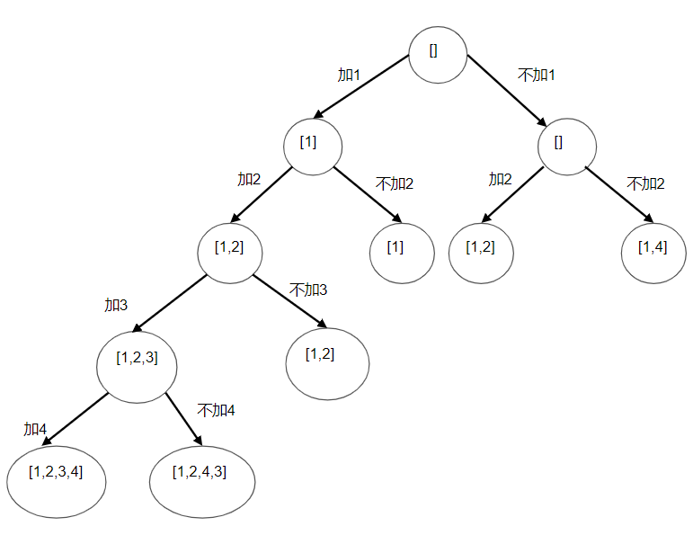

[TOC]

---

# 排列组合问题 

## 全排列问题

### 相关例题
[leeCode 46. 全排列](https://leetcode-cn.com/problems/permutations/)  
[leetCode 47. 全排列 II](https://leetcode-cn.com/problems/permutations-ii/)  
[leetCode 31. 下一个排列](https://leetcode-cn.com/problems/next-permutation/)
[剑指 Offer 38. 字符串的排列](https://leetcode-cn.com/problems/zi-fu-chuan-de-pai-lie-lcof/)

### 求解思路
1. 基本思路  
先举例{a, b, c, d}手动排列，全排列(A_n^n)，就是从n个元素中先后拿出n个元素构成序列，是有先后顺序的。   
一张图可以理解思路：    
  
```p{a, b, c, d}```求解可以先后从```{a, b, c, d}```中先拿出一个元素来，再将剩下的元素进行全排列。
比如，先拿出a来，然后```{a} + p{b, c, d}```就可以遍历完解空间的1/4了；  
具体实现时，将某个元素取出来、再拼接剩下的操作，对数组来说修改的时间复杂度会较高(链表可能会好点)。所以，可以考虑将要取出的元素放在首位————与首位元素先交换，排列完剩下的元素集合后再换回去。   
[leeCode 46. 全排列](https://leetcode-cn.com/problems/permutations/)  
```java
	
public void permuteHelper(int[] nums, int start, List<List<Integer>> result) {
        if (start == nums.length-1) {
            result.add(Arrays.stream(nums).boxed().collect(Collectors.toList()));
        } else {
            for (int i = start; i < nums.length; i++) {
                swap(nums, start, i);
                permuteHelper(nums, start+1, result);
                swap(nums, start, i);
            }
        }
    }
	
public List<List<Integer>> permute(int[] nums) {
        if (nums == null || nums.length == 0) return null;
        int n = nums.length, n_counter = n;
        List<List<Integer>> results = new LinkedList<>();
        permuteHelper(nums, 0, results);
        return results;
    }

```

除此之外，还要考虑重复元素，比如```{abac}```中先取出第一个a和先取出第二个a的最终得到结果集合是一样的。
可以使用Set保存交换过的元素。  
[leetCode 47. 全排列 II](https://leetcode-cn.com/problems/permutations-ii/)  
```java
public void permuteUniqueHelper(int[] nums, int start, List<List<Integer>> results) {
        if (start == nums.length-1) {
            results.add(Arrays.stream(nums).boxed().collect(Collectors.toList()));
        } else {
            Set<Integer> integerSet = new HashSet<>();
            for (int i = start; i < nums.length; i++) {
                if (!integerSet.contains(nums[i])) {
                    swap(nums, start, i);
                    permuteUniqueHelper(nums, start+1, results);
                    swap(nums, start, i);
                    integerSet.add(nums[i]);
                }
            }
        }
    }

```

2. 字典序  
字典序排列算法
可参考解析：[字典序全排列算法研究](http://www.cnblogs.com/pmars/archive/2013/12/04/3458289.html)
一个全排列可看做一个字符串，字符串可有前缀、后缀。
生成给定全排列的下一个排列.所谓一个的下一个就是这一个与下一个之间没有其他的。
这就要求这一个与下一个有尽可能长的共同前缀，也即变化限制在尽可能短的后缀上。  
例如，839647521是1--9的排列。1—9的排列最前面的是123456789，最后面的987654321，
从右向左扫描若都是增的，就到了987654321，也就没有下一个了。否则找出第一次出现下降的位置。  
【例】 如何得到346987521的下一个  
1)，从尾部(i=n-2)往前(i>=0;i--)找第一个nums(i) < nums(i+1)的位置:   
```3 4 6 <- 9 <- 8 <- 7 <- 5 <- 2 <- 1 ```  
最终找到6是第一个变小的数字，记录下6的位置idx1;  
2)，在idx1的后面，从尾部(i=n-1)往前(i>idx1;i--)找第一个大于6的数:  
```3 4 6 -> 9 -> 8 -> 7 5 2 1 ```  
最终找到7的位置，记录位置为idx2;  
3)，交换位置idx1和idx2上的值:  
```3 4 7 9 8 6 5 2 1 ```  
4)，倒序位置idx1+1到n-1上的所有数据:  
```3 4 7 1 2 5 6 8 9 ```  
则347125689为346987521的下一个排列。  
值得注意的是，在第1)步中，如果遍历完所有数据(此时idx1=-1)，都没有满足nums(i) < nums(i+1)，说明此时的字符串是字典序最后一个了。  

具体实现上，应该先将字符串/数组排序，保证初始字符串/数组是字典序第一个，并记得将其加入到结果集中。

```java
public List<List<Integer>> permuteByDictSort(int[] nums){
        if (nums == null || nums.length == 0) return null;
        int n = nums.length, n_counter = n, capacity = 1;
        while (n_counter > 1) capacity *= n_counter--;
        List<List<Integer>> itgLists = new LinkedList<>();
        Arrays.sort(nums);
        itgLists.add(Arrays.stream(nums).boxed().collect(Collectors.toList()));

        while (true) {
            int idx1 = n-2;
            while (idx1 >= 0 && nums[idx1] >= nums[idx1+1]) idx1--;
            if (idx1 == -1) break;
            int idx2 = n-1;
            while (nums[idx2] <= nums[idx1]) idx2--;
            swap(nums, idx1, idx2);
            reverse(nums, idx1+1, n-1);
            itgLists.add(Arrays.stream(nums).boxed().collect(Collectors.toList()));

        }
        return itgLists;
    }
```

字典序全排列寻找的下一个序列必然是“大于”当前序列的，不会存在重复的问题(在实现上是因为<=及>=都被排除了)。


## 子集问题(组合问题)

### 相关例题
[leeCode 78. 子集](https://leetcode-cn.com/problems/subsets/)

### 求解思路
1. 动态规划  
求解思路类似动态规划，在已有解的基础上进行求解。  
例如，已有数组[1,2,3]的全部子集(记 子集的集合S)，则数组[1,2,3,4]的子集包含两部分，一部分就是S，另一部分是在S中每一个子集的基础上添加4。  
其实也不是动态规划，因为每一阶段的规划动作就只有一个，只能算是有记忆的递归(也可以如下不用递归实现)。

```java
public List<List<Integer>> subsets(int[] nums) {
        if (nums == null || nums.length == 0) return null;
        List<List<Integer>> result = new LinkedList<>();
        result.add(new LinkedList<>());
        int n = nums.length;
        for (int i = 0; i < n; i++) {
            // 不能在使用iterator遍历的时候对List进行修改
//            for (List<Integer> subset: result){
//                List<Integer> newSubset = new LinkedList<>(subset);
//                newSubset.add(nums[i]);
//                result.add(newSubset);
//            }
            int numOfSubsetsCur = result.size();
            int newNum = nums[i];
            for (int j = 0; j < numOfSubsetsCur; j++) {
                List<Integer> newSubset = new LinkedList<>(result.get(j));
                newSubset.add(newNum);
                result.add(newSubset);
            }
        }
        return result;
    }
```

2. 位运算  
比较经典的求子集思路
```java
public List<List<Integer>> subsets(int[] nums) {
        if (nums == null || nums.length == 0) return null;
        List<List<Integer>> result = new LinkedList<>();
        result.add(new LinkedList<>());
        int n = nums.length;
        for (int i = 0; i < n; i++) {
            // 不能在使用iterator遍历的时候对List进行修改
//            for (List<Integer> subset: result){
//                List<Integer> newSubset = new LinkedList<>(subset);
//                newSubset.add(nums[i]);
//                result.add(newSubset);
//            }
            int numOfSubsetsCur = result.size();
            int newNum = nums[i];
            for (int j = 0; j < numOfSubsetsCur; j++) {
                List<Integer> newSubset = new LinkedList<>(result.get(j));
                newSubset.add(newNum);
                result.add(newSubset);
            }
        }
        return result;
    }

```


## 组合总和(可重复组合问题)

### 相关例题
[leetCode 39. 组合总和](https://leetcode-cn.com/problems/combination-sum/)  
[leetCode 40. 组合总和 II](https://leetcode-cn.com/problems/combination-sum-ii/)  

### 求解思路
1. 动态规划  
典型的恰好装满背包问题，只不过不是求最佳的解法，但可以利用记忆。

2. 回溯法，见下一节  


## 回溯法
转自[回溯法的思想与实现](https://leetcode-cn.com/problems/combination-sum/comments/224875)  
这里单独将回溯法作为一个小节，因为回溯法的思想在解决上述问题都比较通用。  
先看下上面所提的全排列基本思路的代码，其实就是使用了回溯法，先记住代码大概长什么样子，然后往下面看(脑子里要有棵多叉树)。  

### 回朔法的思想： 
回朔法的重要思想在于： 通过枚举法，对所有可能性进行遍历。 但是枚举的顺序是 一条路走到黑，发现黑之后，退一步，再向前尝试没走过的路。直到所有路都试过。因此回朔法可以简单的理解为： 走不通就退一步的枚举方法就叫回朔法。而这里回退点也叫做回朔点。

### 回朔关键点 
通过分析发现，回朔法实现的三大技术关键点分别是：
1. 一条路走到黑
2. 回退一步
3. 另寻他路

### 关键点的实现 那么如何才能用代码实现上述三个关键点呢？
1. for 循环
2. 递归
其中  
- for循环的作用在于另寻他路： 你用for循环可以实现一个路径选择器的功能，该路径选择器可以逐个选择当前节点下的所有可能往下走下去的分支路径。 例如： 现在你走到了节点a，a就像个十字路口，你从上面来到达了a，可以继续向下走。若此时向下走的路有i条，那么你肯定要逐个的把这i条都试一遍才行。而for的作用就是可以让你逐个把所有向下的i个路径既不重复，也不缺失的都试一遍  

- 递归可以实现一条路走到黑和回退一步： 一条路走到黑： 递归意味着继续向着for给出的路径向下走一步。 如果我们把递归放在for循环内部，那么for每一次的循环，都在给出一个路径之后，进入递归，也就继续向下走了。直到递归出口（走无可走）为止。 那么这就是一条路走到黑的实现方法。 递归从递归出口出来之后，就会实现回退一步。  

因此for循环和递归配合可以实现回朔： 当递归从递归出口出来之后。上一层的for循环就会继续执行了。而for循环的继续执行就会给出当前节点下的下一条可行路径。而后递归调用，就顺着这条从未走过的路径又向下走一步。这就是回朔。  

**回溯代码模板**
```python
def backtrack(state):
    
    if (回朔点）：# 这条路走到底的条件。也是递归出口
        保存该结果
        return   
    
    else:
        for route in all_route_set[state] :  逐步选择当前节点下的所有可能route
            
            if 剪枝条件：
                剪枝前的操作
                return   #不继续往下走了，退回上层，换个路再走
            
            else：#当前路径可能是条可行路径
			
				使用route生成新的状态state_new
        
                backtrack(state_new) #递归发生，继续向下走一步了。
                
```
这里剪枝操作指的是： 对于有些问题，你走着走着，若某种情况发生了，你就已经直到不能继续往下走了，再走也没有用了。而这个情况就被称之为剪枝条件。  
而DFS就是一个最典型的回朔法的应用。  

### 回溯法的使用
再说一下使用回溯法求解问题的思路。回溯法使用了递归，本质上还是对原问题进行分解，找到合适的子问题和到达子问题(状态)的路径。以全排列和全部子集为例，在求```{1,2,3,4}```的全排列时，第一步选择是从```{1,2,3,4}```中选择1/2/3/4放到序列的第一个位置上；而在求```{1,2,3,4}```的全部子集时，第一步选择是，要不要将1添加到子集中。具体区别可见下图。可见，不同问题需要设计不同的状态(子问题)和路径。
值得注意的是，只有叶子节点才是解。  
  
  

**回溯法的代码实现其实就是在构造这棵求解树的所有节点，在实现过程要知道这棵求解树长什么样子。**再结合全排列的代码分析下回溯代码模板：
- 首先是for语句所有可选路径的实现，在上面的两张图(全排列和全部子集)中，可以看出，不同状态下的for可选路径都是不同的，上面全排列的回溯实现是根据参数中传递的nums和start来记录的，如果没有这个start，每个状态都会遍历nums中的所有元素，最终会有重复解。  
- 然后是在for代码段中构造新状态时，其实是有多种实现方式的，可以像全排列那样，修改nums得到新的状态节点，然后对此状态进行回溯，但这种传引用的修改记得回溯完后修改回去；还可以像代码模板一样，基于state创建新的state，然后对新的state进行回溯。很明显，前者对中间状态不用创建新的对象，只对叶子节点生成对象，但这种方法不是所有问题都可以这么做(像这几个求集合的就比较好做)，后者空间复杂度高了些，但更好理解些。


这里再回想一下[动态规划](https://www.cnblogs.com/peanutk/p/13565912.html)里使用递归求解的方法，也是将问题分解成子问题。回溯和动态规划(这里主要指递归实现)不同之处在于，回溯法将所有分支遍历完即可，而动态规划在同一状态下(树的节点)遍历所有分支的同时，要比较不同分支能带来的收益，然后将最大的收益作为当前状态的dp值。回溯法的目的主要还是遍历完所有解(叶子节点)，而dp其实不用遍历完，因为它保存了部分记忆，只记录到某一状态最优的dp值即可(因为有最优子结构的特性)。

### 回溯例题
这里给出求子集和组合总和的代码，以便总结回溯法的套路：
```java
// 回溯求子集
public void subsetsBacktrack(Deque<Integer> state, int[] nums, int start, List<List<Integer>> result) {
        if (start == nums.length) {
            result.add(new ArrayList<>(state));
        } else {
            //这里的可选路径就只有两条，不用for循环了

            // 不选nums[start]
            subsetsBacktrack(state, nums, start+1, result);

            //选nums[start]
            state.addLast(nums[start]);
            subsetsBacktrack(state, nums, start+1, result);
            state.removeLast();
        }
    }

```

```java
// 回溯求组合和

	/*
    关键是如何设计路径来构造求解树
    这里给出的方法是，从可选数字中选一个添加到当前state中，为了避免重复解，可选数字只能是比到达当前状态的路径所代表数字更大或等于的数字。
    例如,对于{1,2,3,4},初始状态[],在第一次选择了3得到状态[3]后，接下来只能在3/4中选择，不允许选择1/2是因为在选择了1/2的状态中已经有选择3的。
    其实，这种思路更容易想起动态规划。
     */
    public List<List<Integer>> combinationSumByBacktrack(int[] candidates, int target) {
        if (candidates == null || candidates.length == 0) return null;
        Arrays.sort(candidates);
        List<List<Integer>> result = new LinkedList<>();
        Deque<Integer> state_root = new LinkedList<>();
        combinationSumBacktrack(state_root, candidates, 0, target, result);
        return result;
    }

    public void combinationSumBacktrack(Deque<Integer> state, int[] nums, int start, int target, List<List<Integer>> result) {
        if (target == 0) {
            result.add(new ArrayList<>(state));
        } else {
            for (int i = start; i < nums.length; i++) {
                if (target < nums[i]) {
                    return;
                }
                state.addLast(nums[i]);
                combinationSumBacktrack(state, nums, i, target-nums[i], result);
                state.removeLast();
            }
        }
    }


```
其实，通过这个例子更能看出来回溯和动态规划的区别，动态规划可以有效地利用记忆，另外一点就是上面说的动态规划更强调找“最优”，这里想到动态规划是因为利用记忆。   


