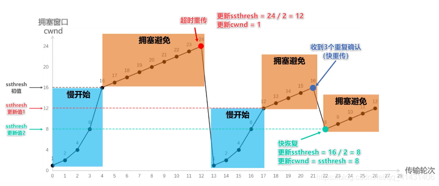

##面经

### 20200818 海尔-物联网开发工程师
> HR、技术、技术经理混合面试，微信视频面  
> 算是研究生阶段的第一场面试吧
1. 自我介绍
2. 怎么不介绍下你的获奖情况
```
好汉不提当年勇
```
3. 项目介绍
```
没准备好怎么讲，说到边缘计算然后大脑短片了，然后把话题引到强化学习————反正就是强化学习在资源调度方向的应用:(
```
4. 针对项目的深入提问，说下强化学习用了什么数据集，数据怎么清洗
```
强化学习的数据是与环境交互产生的，环境模型建立好之后不断交互就会得到源源不断的数据，不用清洗，顶多是让agent往自己想要的方向去探索
```
5. 语言会哪些
```
主要是Java，Python也比较熟
```
- 使用python调用过Tensorflow的哪些强化学习算法？
```
Tensorflow没有给出强化学习算法，主要提供的是对张量的操作，通过这些操作自己来编写实现强化学习算法；
```
- Java基本数据类型有哪些
```
按字节大小说了一遍
```
- Java Spring APO 面向切面编程
```
应该是AOP吧，以前用过，但是我三年没用，现在确实忘了
```
- 会HTML、CSS吗
```
讲了下本科课设Java Web教学管理系统用JSP+Servlet的框架里，JSP是java和HTML混合的，写了一些，也有写些JS；
另外，在用python爬虫的时候对HTML进行正则匹配之类的，所以也是比较熟的。
```
- 写过哪些sql语句
```
课设的时候写了一些基础的建表，增删改查，大部分还是使用JPA提供的注解；实习项目中mybatis.xml中写过的比较多，讲了下预编译防sql注入
```
6. 为什么选择北京、青岛、上海，看你生源地是运城的，是shan(三声)西运城吧？
```
北上广深杭技术氛围好可以学到更多但买不起房，武汉南京西安青岛这些还可以想想；
嗯，shan西运城，shan东的shan
```
7. 为什么选择海尔？
```
实业兴国
//这里一顿瞎扯，投之前连看都没看，广撒网。
//可能是因为我家热水器洗衣机是海尔的吧
```
8. 职业规划？
```
对互联网这边有一定的规划，但对海尔的体系不太了解
```
然后HR介绍了轮岗制度  
9. 有什么想问的？
```
没有
```
//问的都是啥，而且给HR的感觉就是我并没有想去海尔，估计凉了。


### 20200901转转-后端开发工程师
1. 自我介绍

2. Redis数据类型

3. 数据结构
3.1 二叉树与多叉树的区别
3.2 红黑树

4. 网络
4.1 HTTP不同版本
4.2 输入url回车
4.3 TCP三次握手
4.4 TCP如何保证可靠 

5. Java
5.1 如何实现方法并发
5.2 不用reverse函数，如何反转String

6. 想问的

### 20200915 腾讯
1. HashMap讲一下
- 存储结构上：数组+链表+红黑树
	- 具体来讲，维护一个初始length=16的Node数组，并设置 threshold=length\*LoadFactor, 解决冲突用的拉链法;
	- 1.8的HashMap做了以下优化：
		- 链表长度大于8时转为红黑树；
		- 取hashCode值后让高位参与运算(h = key.hashCode()) ^ (h >>> 16)，当length比较小时可以减少冲突；
		- length长度为2^n，取模运算是通过hashcode & (length-1)来实现，在扩容时，Node对应的下标要么还是原来的位置，要么加2^n，减少了再次计算hashCode的时间，并且可以将原来冲突的节点分散到新的bucket里。
- get
	- 获取key的hashcode，高位参与运算(h = key.hashCode()) ^ (h >>> 16)，使用&取模便得到下标；
	- 遍历链表或二分查找红黑树。
- put
	- .1 table == null || length==0 ? 扩容、计算下标并插入 : 
	- .2 计算下标i，table[i] == null ? 直接插入 ：key.equals ? 覆盖value : table[i]是否为TreeNode ? 遍历红黑树插入/覆盖 : 遍历链表准备插入/覆盖，如果链表长度大于8则转为红黑树再插入/覆盖
	- .3 ++size > threshold ? 扩容 : end
JDK1.7的HashMap多线程中为什么会发生死循环？

2. HashMap为什么不是线程安全的，ConcurrentHashMap怎么保证线程安全？
- HashMap线程不安全主要是因为多个线程可以同时对HashMap的数组/链表/红黑树修改，会造成数据覆盖问题；
	- 除此之外，JDK1.7的HashMap还会造成死循环、数据丢失问题，这是因为扩容方法用到的transfer是采用头插法，会把链表顺序反转，线程一transfer执行到一半时时间片用完、线程二开始执行并把transfer执行完，再轮到线程一执行时、链表最后一个Node的next已经不为null了(如果hashCode相同的话)，链表会出现环。
	- JDK1.8使用尾插法，不会有死循环问题，但put时仍存在数据覆盖问题。[JDK1.7和JDK1.8中HashMap为什么是线程不安全的](https://blog.csdn.net/swpu_ocean/article/details/88917958)


3. 为什么要双亲委派？
Java虚拟机中类的唯一性是由类加载器和类文件共同确定的，每个类加载器都有自己的类名空间；
如果不通过双亲委派由BootStrapClassLoader最先加载的话，classpath下的用户自定义的与核心类同名的类(比如java.lang.Object)会被AppClassLoader先加载，基础类不能保证唯一性，可能会引起混乱。

4. Java什么情况下会遇到内存泄漏？
静态变量指向对象，尤其是容器对象时

5. IPC不同方式的应用场景？线程间如何通信？
- 管道
	- 无名管道父子间
		- 管道本质上是一种特殊的文件，对应内核空间中的一段内存(通常定长4K)，父子进程退出则释放内存
		- 一对一，半双工
		- 无格式
	-有名管道无亲缘关系间
		- 有名管道名称保存在磁盘上，内容也在内核内存，两进程通信结束后内容释放但文件路径还在磁盘上
- 消息队列
	- 消息的链表，由内核维护的一段内存，由标识符标识各个进程的消息队列
	- 多对一(多个进程向一个进程的消息队列里写)
	- 有格式
- 共享内存
	- 进程将一段用户空间物理内存连接到自己的地址空间中，通信效率高
	- 没有提供同步机制，需信号量配合
- Socket
	- 通常跨主机进程间
	
6. 进程和线程的区别？
- 基本单位
- 进程有独立的地址空间，而线程没有，同一进程的线程共享进程的地址空间，这种共享使得线程间通信更方便，但一个线程崩溃可能会引起整个进程崩溃；
进程有资源，相应的创建开销和切换开销就会大些，但一个进程崩溃不会影响其他进程。

7. 虚拟内存怎么回事？
虚拟内存主要是利用了程序执行的局部性特点，只需要将程序的部分代码和数据放入内存即可运行；
操作系统将外存分为存放文件的文件区和存放对换页面的对换区，再提供部分装入、请求调入和置换的功能来实现虚拟内存。
通过把程序分多次调入调出内存，来使得用户感觉到的内存远大于实际内存。

8. 用户态、内核态何时切换？
当用户程序需要用到进程管理(包括进程控制、进程通信)、内存管理、设备管理、文件管理这些系统调用时，会通过中断或异常而陷入内核态。
内核态和用户态的实现是通过一个特殊的CPU寄存器来标识的。

9. 一个进程最多起多少个线程？是什么限制的？

10. 操作系统的32位、64位是指什么？

11. 线程池

12. TCP如何做到拥控、流控？
- 流控：根据接收方返回的确认报文中的窗口字段值控制自己的发送窗口大小
- 拥控：
	- 慢启动 (翻倍)增长
	- 拥塞避免：cwnd达到ssthresh后(+1)增长
	- 遇到超时重传：cwnd=1;ssthresh/=2;慢启动;
	- 三个冗余ACK：ssthresh/=2;cwnd=ssthresh;快恢复；

13. UDP不可靠为什么还要用UDP？
- 主要是应用需求不同，有的服务(比如视频语音通话)对实时性要求较高、但对可靠性要求没那么高，UDP更能满足低延时的需求，而且，语音如果使用保证有序且可靠的TCP，一旦某个报文段丢失但后续的报文段都到来了，用户体验会比较差；
- 其次，UDP不需要维持连接，服务器因此可以节省系统资源；
- 还有，UDP的首部要小于TCP，可以更高效地利用网络带宽。

14. TCP如何粘包？

15. TIME_WAIT是怎么回事？如果有很多TIME_WAIT状态？

16. TCP如何保证可靠
- 有连接的，三次握手确认双方通信能力；
- 校验和，确保正确
- 序号和确认号以及重传，确保有序、以及丢的包能补上
- 流量控制，接收端缓冲区不溢出
- 拥塞控制，考虑网络全局情况，不会在网络已经拥塞的情况还不加节制地发包

17. Socket编程

### 20200924 恒大
1. 接口和抽象类的区别
- 主要还是接口和类
	- 接口没有构造函数，而抽象类有；
	- 接口不能有静态代码块，而抽象类可以有；
	- 接口是抽象方法的集合，即所有方法都没有方法体，都是public abstract修饰的(1.8之后可以有默认实现)；而抽象类的方法可以有方法体；
	- 接口没有成员变量，所有变量都是public static final修饰的；
	- 类实现接口可以多实现，但类继承类只能单继承；接口继承接口可以多继承；
	- 没有实现所有abstract方法的类必须声明为abstract class

2. 堆和栈的区别

3. HashMap和HashTable的区别

4. 统计一棵树的节点个数

5. 二叉树查找

6. Hadoop
不会，然后就面试结束了。。。

## 互动面
参考[程序员：过了一面二面，千万别栽在HR面——70道HR面试题分享](https://zhuanlan.zhihu.com/p/87908851)挨个过一遍
1. 有什么优势劣势？
性格/为人：很和善真诚、(乐于助人、幽默)
能力方面：学习方面融会贯通、举一反三的能力比较强些吧，解决问题时分析推理能力也比较强些，就有点像知识网络之间互联信号比较强些吧。
核心竞争力：(语气沉重)对自己做的东西都会很负责，习惯给自己做的东西打分，80分及格线，同学对我的评价基本都是很靠谱。
劣势：有时候会陷入原理，效率比较低，但从来不超ddl(举例)，另一方面，原理清楚为的是以后更高效率