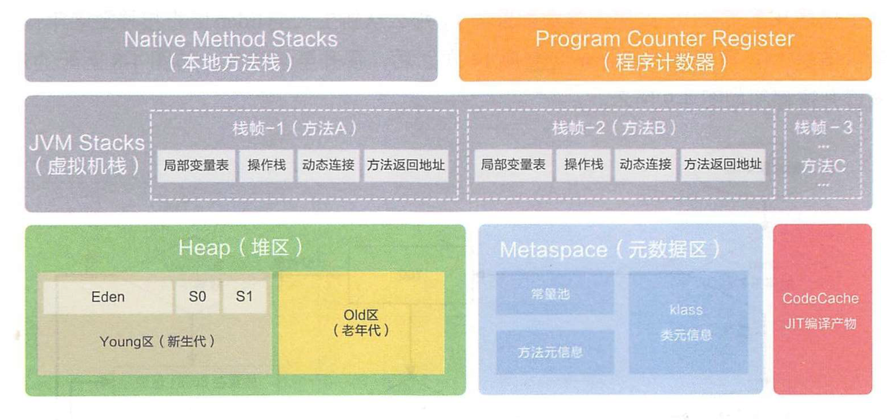

[TOC] 
---

### 从JVM的字符串常量池理解String.intern()
#### ref1: [从字符串到常量池，一文看懂String类](https://blog.csdn.net/qq_41907991/article/details/106799400)
- class文件的结构  
- class常量池中存的是字面量和符号引用，也就是说他们存的并不是对象的实例，经过解析（resolve）之后，才会把符号引用替换为直接引用  
不同版本的JVM内存模型  
- 字符串常量池中实际存放的是字符串的引用，而不是字符串实例  
- String s = new String("1")是怎么产生两个对象的  
- JDK1.6和JDK1.7对intern方法的实际操作区别(主要是1.7将驻留字符串实例都存放在堆中，可以直接让一个常量池引用指向驻留字符串，而不用将堆中的字符串对象拷贝到没有该字符串的永久代中)   
- String s1 = new String("1") + new String("1")实际还调用了StringBuilder.append()方法  
- JDK1.6的永久代、1.7/1.8的元空间都是对方法区的不同实现  

#### ref2: [美团-深入解析String.intern()](https://tech.meituan.com/2014/03/06/in-depth-understanding-string-intern.html)
- Java为了提高运行速度及节省内存，为8种基本类型和String都提供了常量池；
- 基本类型的常量池是系统协调的，字符串常量池有两种使用方法：双引号引用，String.intern()
- JDK1.7之前，字符串常量池位于Perm区，而Perm区默认只有4M；由于字符串常量池太占Perm区空间，1.7将字符串常量池移到堆中。
- 1.7中调用intern()时，不再复制字符串到Perm区的字符串常量池中(然后StringTable中一个item指向这个驻留字符串)，而是让堆中字符串常量池的StringTable指向这个对象，使其成为驻留字符串；
- String pool是通过维护StringTable指向字符串来维护字符串常量池的，StringTable的实现与HashMap相似，只是不能扩容，默认StringTable的数组容量只有1009，如果使用intern往StringTable中放入了过多的指向驻留字符串的引用，就会产生Hash冲突，链表增长，导致继续调用intern()时性能大幅下降。


### 由ArrayList相关延伸出
1. 为什么elementData用transient修饰，这样不就不能序列化了吗？  
ArrayList中elementData在缓存中会预留一些空间(capacity-size)，实际只有size个element需要被序列化，直接序列化会使capacity-size的那部分也被序列化。如果需要序列化，使用ArrayList.writeObject(ObjectOutputStream)和readObject(ObjectInputStream)方法即可。

2. ArrayList不是线程安全的，需要线程安全可选择使用Vector或者CopyOnWriteArrayList。  
这里理解一下[CopyOnWrite](http://ifeve.com/java-copy-on-write/) ，Java提供了两个利用这个机制实现的线程安全集合——CopyOnWriteArrayList和opyOnWriteArraySet。  
CopyOnWrite，就是写时复制，例如ArrayList.add()方法中，先getArray()将array暂存到newElements中，修改newElements，之后再setArray(newElements)。这是一种读写分离的思想，读和写操作的是不同的集合，因此缺点也是很明显的，其他线程还是有可能读取到旧的数据。  
另外，add时会使用ReentrantLock加锁，不然会有多个线程复制出多个副本(引用)来，但即使这样，频繁地增删改还是会复制很多副本，因此CopyOnWriteArrayList适合读多改少的情景。   
另外，值得注意的是，CopyOnWriteArrayList是没有capacity的概念的，这也是可以通过add方法看出来的。  
还有，CopyOnWriteArrayList的元素数组array是volatile的，可以保证一个线程对array的修改对其他线程是立即可见的。


### volatile与JVM
继续上面提到的volatile，它的基本原理是什么？   
1. 在此之前先了解[Java内存模型JMM](https://www.jianshu.com/p/15106e9c4bf3)
- 主内存与线程的工作内存间的交互，8种操作的原子性(虚拟机没有直接将其中lock和unlock提供给用户，但往上对应的synchronized可对应)
- 从主内存读取变量到工作内存要用到哪些操作、工作内存将修改后的变量写回主内存要用到哪些操作；
- 操作重排序: read a; load a; read b; load b; -> read a; read b; load b; load a;
- volatile变量禁止指令重排序优化。
- 对long和double(64位)普通变量的8种操作不保证原子性，JLS建议线程间共享的long和double变量声明为volatile。
2. 明确volatile的作用：
```java
public class VolatileTest {
//    boolean flag = true;
    volatile boolean flag = true;
    int i = 0;

    public static void main(String[] args) throws Exception {
        VolatileTest volatileTest = new VolatileTest();
        Thread thread = new Thread(new Runnable() {
            @Override
            public void run() {
                while (volatileTest.flag) {
                    volatileTest.i++;
                }
                System.out.println(volatileTest.i);  //flag不是volatile的话，不会执行到这一步的
            }
        });
        thread.start();
        Thread.sleep(2000);
        volatileTest.flag = false;
        System.out.println("volatileTest.i = " + volatileTest.i);
    }
}
```
ref:[volatile关键字的作用](https://www.cnblogs.com/xd502djj/p/9873067.html)
- volatile保证了当一个线程修改了变量时(该线程将工作区中的变量副本store&write到主内存中了)，强制其他使用到这个变量的线程去主内存中读取新值。
- volatile可以保证单次读(read&load)/写(store&write)操作的原子性(通过禁止指令重排序优化)，但像i++这样的复合操作是不能保证原子性的(i++用到了read&load&use&assign&store&write操作)。
3. 基本原理

- 对于上述第一点，变量的可见性，主要是通过volatile变量写操作的两个特性实现的：
(1) 修改volatile变量时，会强制将修改后的值刷新到主内存中；
(2) 修改volatile变量后，会导致其他线程工作内存中对应的变量值失效，从而不得不从主内存中重新读取。

- 第二点，根据Java编译器的重排序以及JSR定义的happen-before规则  

具体参考ref[Java 并发编程：volatile的使用及其原理](https://www.cnblogs.com/paddix/p/5428507.html)

4. 与synchronized
4.1 多线程并发过程主要处理原子性、可见性、有序性问题；  
synchronized三者都可以保证：  
(1) 原子性：synchronized经过编译之后，对应的是class文件中的monitorenter和monitorexit这两个字节码指令。这两个字节码对应的内存模型的操作是lock（上锁）和unlock（解锁），而这两个操作之间的运行都是原子的。  
synchronized方法/代码块是

(2) 可见性：synchronized要求的对变量unlock之前，必须将变量值从工作内存更新到主内存。
另一方面，其他线程的工作内存中并不会存在该变量的副本，所以也就不存在旧值问题。

(3) 有序性：当线程运行到synchronized代码块内时，其他线程无法获得锁、不能进入该代码块，此时代码块的运行就是单线程的，而指令重排序导致线程不安全是多线程同时运行情况下的。

ref[synchronized为什么具有可见性，原子性，有序性？](https://blog.csdn.net/qq_35590091/article/details/106986641)
而根据上面对volatile的分析，它只能保证可见性和有序性，并不能保证原子性。  
4.2 volatile和synchronized的区别
- 原子性: 如上所述，volatile不能保证，而synchronized可以保证；
- 可见性：首先是写回：修改当前volatile变量后必须将修改后的值写回到主内存，而synchronized要求的是unlock前要写回(即使没有更新？)；
再者是其他线程：修改volatile变量会致使其他线程工作内存中的变量值失效，而synchronized由于lock的存在，其他线程工作内存是没有该变量的。 
- 有序性：volatile标记的变量不会被编译器优化；synchronized标记的变量可以被编译器优化，但由于同一时刻只有一个线程在执行该段代码，即使被优化，还是能保证有序性的。  
- 使用范围：volatile仅能使用在变量级别；synchronized则可以使用在变量、方法、和类级别的。  
- 性能：volatile不会造成线程的阻塞；synchronized可能会造成线程的阻塞。


### 从JVM栈帧理解i=i++
1. 将class文件通过javap反编译得到可读的字节码：
```javap -p -v Test.class```  
2. 理解局部变量表和操作数栈各负责什么[JVM 栈帧（Stack Frame）](https://www.cnblogs.com/jhxxb/p/11001238.html)
3. 再理解为什么i=i++后，i的值不变：[java中i=i++问题解析](https://zhuanlan.zhihu.com/p/40645506)。
其实关键问题出在iinc指令上。
> 指令iinc对给定的局部变量做自增操作，这条指令是少数几个执行过程中完全不修改操作数栈的指令。它接收两个操作数：
第1个局部变量表的位置，第2个位累加数。比如常见的i++,就会产生这条指令  
4. 分析i++，起初i为0
- ```i=i++``` 先iload a到操作数栈中，然后iinc i在局部变量表中自增为1，接着istore操作数栈中的0到局部变量表中的i中。
- ```c = b+ i++;```会先iload b到操作数栈中，然后iload i到操作数栈中，然后iinc i在局部变量表中自增为1，但此时操作数栈中的i仍为0，接着执行add，add后的操作数栈中的值istore到c中。

[Java虚拟机常用指令](https://blog.csdn.net/qq_33301113/article/details/73717855)
这样，执行i++时，先把i的值从局部变量表中load到操作数栈中，iinc直接在局部变量表中实现i自增；接着执行i=…的时候，把操作数栈的栈顶(未增)赋值给i了。
> 此处一个推测，执行++i时，先是执行iinc在局部变量表中实现了自增，再将增后的i load到操作数栈中。  
> 题外话，观察字节码文件，iinc指令和下一条指令的编号相差3，这个3是指需要下一层的3个指令才能完成iinc？


### CAS操作
继续说到volatile，它不保证原子性，像i++这种非原子性操作，多线程协作就会出现值覆盖问题:
```java
public class VolatileTest {
    public static volatile int count = 0;    
 
    public void testSimpleAdd() throws InterruptedException {
        int nThreads = 20;
        int nAdd = 10000;

        long start = System.currentTimeMillis();
        for (int i = 0; i < nThreads; i++) {
            new Thread(()-> {
                for (int j = 0; j < nAdd; j++) {
                    count++;
                }
            }).start();
        }
		// IDEA在debug模式下运行，run模式会有Monitor Ctrl-Break线程
        while (Thread.activeCount()>1) {
            Thread.yield();
        }
        System.out.println("count = " + count);
        System.out.println("time : " + (System.currentTimeMillis() - start));
    }
}
```
最后的结果会小于200000。
保证i++操作的原子性除了synchronized和lock外，还可以使用java.util.concurrent.atomic包中提供的原子类，这些原子类提供了原子操作，例如i++有相应的atomicInteger.getAndIncrement()方法来保证原子性。  
至于具体的实现，就是用到了CompareAndSwap(CAS)。具体介绍见[面试必问的CAS](https://blog.csdn.net/v123411739/article/details/79561458)。  
这里看下getAndIncrement是如何实现原子性的：
```java
public final int getAndIncrement() {
        return unsafe.getAndAddInt(this, valueOffset, 1);
    }

public final int getAndAddInt(Object o, long offset, int delta) {
        int v;
        do {
            v = this.getIntVolatile(o, offset);
        } while(!this.compareAndSwapInt(o, offset, v, v + delta));

        return v;
    }
```
getAndIncrement方法调用getAndAddInt方法，最后调用的是compareAndSwapInt方法，即CAS。  
getAndAddInt方法拿到内存位置的最新值v，使用CAS尝试将内存位置的值修改为目标值v+delta；如果修改失败，则获取该内存位置的新值v，然后继续尝试，直至修改成功。  
可以看出，它的原子性保证是通过getIntVolatile拿到最新值后、在执行修改之前，添加了一个比较操作，确保这两者之间其他线程没有修改值(其实还有ABA问题，可以使用带有版本号的AtomicStampedReference来解决)。


### 垃圾回收GC
ref:[Java垃圾回收](https://www.cnblogs.com/czwbig/p/11127159.html) 未完。
1. Java垃圾回收主要关注的是堆，也有方法区  
   
Java内存中的虚拟机栈、本地方法栈的内存大小分配都是根据类结构可以确定的，并且随线程而生灭；而堆内的对象的个数及类型在运行时动态不确定的，这部分需要由垃圾收集器来进行管理。

2. 哪些对象需要被回收  
堆中不被引用的对象，可通过两种方法确定：  
- 引用计数法，但不能解决循环引用问题
- GC Roots可达性分析
方法区主要回收两部分：
- 废弃常量，与堆中不被引用的对象类似
- 无用的类，需要同时满足三个条件

3. 强、软、弱、虚引用

4. 垃圾收集算法
- 标记-清除，效率低、且会产生大量碎片
- 复制算法，对半分 -> 新生代中的对象98%朝生夕死 -> Eden+Survivor中存活的复制到另一个Survivor，不够了向Old区借
- 标记-整理，标记后让所有存活对象像一端移动，直接清掉端边界以外的内存
- 分代收集，不是什么新算法，只是上面算法综合。Yong区用复制，Old用标记-整理或标记-清除


### Java的编译解释与类加载机制
[JVM是怎么和操作系统交互的](https://blog.csdn.net/u013256816/article/details/103306252)
[Java代码是如何编译成机器指令的](https://blog.csdn.net/moakun/article/details/83043868  
Java编译得到.class字节码文件，然后JVM解释执行字节码文件，对于不同的OS甚至硬件上，JVM可以把字节码文件一句一句地翻译成不同的机器指令。

[超详细java中的ClassLoader详解](https://blog.csdn.net/briblue/article/details/54973413)
1. 动态加载：JVM启动时并不会一次性加载所有的class文件，而是根据需要去动态加载
2. sun.misc.launcher是JVM的入口应用，它会初始化：
- BootstrapClassLoader：最顶层的加载类，主要加载核心类库，%JRE_HOME%\lib下的rt.jar、resources.jar、charsets.jar和class等
- ExtClassLoader：扩展的类加载器，加载目录%JRE_HOME%\lib\ext目录下的jar包和class文件
- AppClassLoader：也称为SystemAppClass，加载当前应用的classpath的所有类。
3. AppClassLoader -(parent)-> ExtClassLoader -(parent 其实这里并不是显示指定的)-> BootstrapClassLoader。
如果一个ClassLoader未指定parent，则其parent会被JVM内置的BootstrapClassLoader去替代。
4. loadClass()方法的过程 ———— 双亲委托
5. 自定义ClassLoader： 
- 需求：自定义路径/加密.class文件……
- 如何定义
6. Context ClassLoader

## 推荐阅读
[美团技术团队](https://tech.meituan.com/tags/java.html)